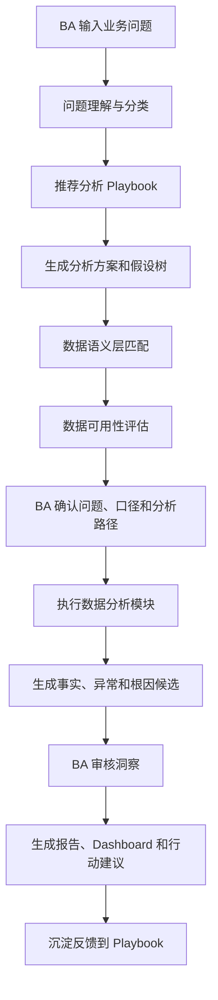

# 汽车行业 Sales BP 分析 Agent 设计方案

## 1. 目标定位

长期目标：让 Agent 逐步替代 Sales BP / BA 日常分析工作中的重复性流程，包括问题拆解、取数分析、洞察归因、报告生成和行动建议。

短期目标：先构建一个通用分析工作台，让 BA 能基于任意业务问题驱动 Agent 工作，而不是只能处理固定的漏斗分析场景。

核心原则：

- 以业务问题为入口，而不是以报表或固定指标为入口。
- Agent 先生成分析思路，BA 确认后再跑数据。
- 所有指标口径、数据可用性、洞察结论都显式展示。
- BA 可维护问题模板、分析 Playbook、指标口径和数据语义层。
- 报告结论必须绑定数据证据，区分事实、推断和建议。

## 2. 总体工作流

## 3. Agent 拆分

### 3.1 分析策略 Agent

职责：

- 解析自然语言业务问题。
- 识别问题类型和分析对象。
- 推荐分析 Playbook。
- 生成假设树、指标树、分析路径和数据需求。
- 判断当前数据是否支持分析。
- 生成 BA 需要确认的问题。

输入：

- 业务问题。
- 业务背景：品牌、区域、车系、渠道、时间范围、对比基准。
- 问题类型库。
- 分析方法库。
- 指标口径库。
- 数据语义层。
- BA 维护的 Playbook。

输出：

- 标准化业务问题。
- 问题分类。
- 分析目标。
- 分析路径。
- 假设树。
- 指标树。
- 数据需求清单。
- 可用数据、代理指标、缺失数据。
- 待 BA 确认项。

### 3.2 数据分析与洞察 Agent

职责：

- 读取 BA 确认后的分析方案。
- 匹配数据表、字段和 join key。
- 识别数据粒度。
- 生成查询或计算逻辑。
- 执行趋势、结构、贡献度、异常、漏斗、Cohort 等分析。
- 输出可解释事实和初步洞察。

输入：

- BA 确认后的分析计划。
- 数据连接或 CSV 文件。
- 数据语义层。
- 指标口径。
- 分析维度和过滤条件。

输出：

- 数据质量报告。
- 指标结果表。
- 分析模块结果。
- 异常清单。
- 贡献度拆解。
- 根因候选。
- 每条洞察的证据链。

### 3.3 业务洞察 Agent

职责：

- 把分析结果翻译成 Sales BP 语言。
- 判断洞察可信度。
- 区分事实、推断和建议。
- 识别需要补充验证的数据。
- 生成行动建议。

输入：

- 数据分析结果。
- 业务规则。
- 历史案例。
- BA 审核反馈。

输出：

- 核心洞察。
- 证据指标。
- 影响范围。
- 可能原因。
- 建议动作。
- 数据限制。
- 置信等级。

### 3.4 报告生成 Agent

职责：

- 基于已确认洞察生成面向不同受众的报告。
- 选择合适图表。
- 组织故事线。
- 输出 Dashboard、PPT、PDF、Excel 或 Markdown。

输入：

- 已确认洞察。
- 报告模板。
- 受众类型。
- 输出格式。

输出：

- 管理层摘要。
- BP 分析报告。
- 可视化图表。
- 行动建议清单。
- Appendix 和数据口径说明。

## 4. 灵活性的关键设计

### 4.1 业务问题分类器

Agent 先判断问题属于哪类，再选择分析方法。

| 类型 | 示例问题 | 常用分析方法 |
|---|---|---|
| 表现诊断 | 为什么某区域销量下降 | 趋势、贡献度、结构、漏斗、异常 |
| 机会识别 | 哪些经销商有增长潜力 | 排名、分层、潜力评分、对标 |
| 归因解释 | 本月订单缺口来自哪里 | 贡献度、瀑布拆解、分层对比 |
| 对比评估 | A 活动比 B 活动好吗 | 分组对比、转化、成本效率 |
| 预测预警 | 月底能否完成目标 | 趋势外推、目标差距、风险评分 |
| 运营监控 | 哪些门店跟进异常 | 异常检测、SLA、明细穿透 |
| 策略建议 | 资源应该投向哪里 | ROI、潜力、约束条件、情景模拟 |

### 4.2 分析方法库

方法不是写死在一个流程里，而是按问题组合调用。

- 趋势分析：日、周、月走势，同比、环比。
- 漏斗分析：register、leads、oppty、visit、test drive、order、handover。
- 结构分析：区域、渠道、车系、经销商、顾问、客户类型。
- 贡献度分析：定位增长或下滑的主要来源。
- 分层对比：高低表现组、重点与非重点对象对比。
- 异常检测：突增、突降、断点、离群门店。
- Cohort 分析：不同进入时间的线索后续表现。
- 时效分析：首次跟进、到店、试驾、订单耗时。
- 战败/取消原因分析。
- 目标差距分析。
- 排名与潜力分析。
- 预测预警分析。

### 4.3 数据语义层

Agent 不直接依赖某个 CSV 字段名，而是依赖业务对象和字段映射。

当前 CSV 已识别的字段组：

| 字段组 | 字段数 | 业务含义 |
|---|---:|---|
| register | 117 | 注册和初始线索来源 |
| leads | 144 | 线索主数据和跟进信息 |
| oppty | 172 | 销售机会、阶段、战败、跟进 |
| visit | 169 | 到店、邀约、接待 |
| td | 36 | 试驾 |
| order | 84 | 订单、取消、交车 |
| customer | 30 | 客户、会员、忠诚客户 |
| dealer / sales / region / city | 21 | 经销商和区域组织 |

### 4.4 指标和口径库

每个指标必须有：

- 业务定义。
- 计算公式。
- 所需字段。
- 可用数据源。
- 适用问题类型。
- 过滤条件。
- BA 确认状态。

示例：

- 订单量：去重 `order_id`，排除删除订单，可按业务确认是否排除取消。
- 到店量：去重 `visit_id`，默认使用有效到店。
- 试驾量：去重 `td_id`，默认排除删除试驾。
- 首次跟进时效：`leads_first_follow_mindiff` 或 `oppty_first_oppty_follow_mindiff`。
- 订单取消率：取消订单 / 总订单。

## 5. BA 确认机制

每一步都需要 BA 确认，避免 Agent 黑盒分析。

| 节点 | BA 确认内容 |
|---|---|
| 问题确认 | 业务问题、分析对象、时间范围、对比基准 |
| 方案确认 | 问题分类、假设树、分析方法、维度 |
| 数据确认 | 字段映射、数据粒度、缺失数据、代理指标 |
| 口径确认 | 指标定义、过滤条件、去重逻辑 |
| 洞察确认 | 采纳、修改、驳回、补充分析 |
| 报告确认 | 受众、故事线、图表、行动建议 |

## 6. 前端页面

### 6.1 业务问题工作台

功能：

- 输入自然语言问题。
- 选择业务范围、时间范围、对比基准、目标受众。
- 展示 Agent 自动识别的问题类型。
- BA 确认后进入方案画布。

### 6.2 分析方案画布

功能：

- 展示分析目标、假设树、指标树和分析模块。
- BA 可增删分析分支。
- 支持选择分析方法库中的模块。
- 显示每个模块的前置数据需求。

### 6.3 数据能力匹配页

功能：

- 展示每个分析分支的数据支持情况。
- 标记：可直接分析、可用代理指标、需补充数据、不可分析。
- 展示字段映射和 join key。
- 提示数据质量风险。

### 6.4 指标与口径确认页

功能：

- 展示所有待使用指标的定义和公式。
- BA 可修改口径。
- 支持保存为团队标准口径。

### 6.5 分析执行页

功能：

- 按模块执行分析。
- 展示运行状态、样本量、过滤条件和计算逻辑。
- 支持暂停、重跑、跳过某模块。

### 6.6 洞察审核页

功能：

- 每条洞察展示证据、影响、可信度和数据限制。
- BA 可采纳、修改、驳回、要求补充分析。
- 审核反馈回写到 Playbook。

### 6.7 报告与行动页

功能：

- 生成管理层摘要、BP 报告、Dashboard 和行动建议。
- 每个结论可追溯到指标和分析模块。
- 支持导出 PPT / PDF / Excel。

## 7. 首批 MVP 范围

第一版建议做“通用问题分析框架 + 3 个高频模板”，而不是只做一个漏斗场景。

内置模板：

1. 业绩下降诊断：订单、销量、交车下降。
2. 转化效率诊断：线索到机会、到店、试驾、订单转化。
3. 渠道 / 活动效果评估：渠道质量、活动效果、后续转化。

后续扩展：

- 经销商运营诊断。
- 区域达成预警。
- 车系表现分析。
- 客户质量分析。
- 销售顾问效率分析。
- 战败原因分析。
- 订单取消分析。
- 资源配置建议。

## 8. 当前数据支持与缺口

基于已查看的 CSV，当前数据能支持：

- 全链路销售漏斗。
- 区域、城市、经销商、小区、品牌、车系维度拆解。
- 渠道、活动、媒体、线索来源拆解。
- 跟进次数、首次跟进时效、机会阶段。
- 到店、邀约、试驾、订单、取消、交车相关分析。
- 战败、拒绝、取消原因的初步分析。
- 客户忠诚、会员、历史车辆等部分客户质量分析。

需要补充的数据：

- 销售目标、月度计划、区域目标。
- 媒体投放成本、活动预算、CPL、CPA。
- 库存、价格、优惠、金融政策。
- 市场大盘、竞品销量。
- 销售人员排班、产能、组织调整。
- 明确数据字典和口径说明。

## 9. 技术落地建议

### 9.1 后端服务

- Orchestrator：流程编排和审批状态。
- Agent Service：多 Agent 调用、提示词模板、工具调用。
- Semantic Layer Service：业务对象、字段映射、join graph。
- Metric Service：指标定义、公式、口径版本。
- Analysis Runtime：SQL / Python / Spark 执行。
- Report Service：图表、PPT、PDF、Dashboard 输出。

### 9.2 数据资产

- 数据目录。
- 字段语义映射。
- 指标字典。
- 分析 Playbook。
- 报告模板。
- BA 审核反馈库。

### 9.3 权限与合规

- 对手机号、VIN、客户 ID 等敏感字段默认脱敏。
- Agent 展示聚合结果优先，明细穿透需要权限。
- 所有分析过程保留审计日志。
- 报告中显式标注数据时间、口径和限制。

